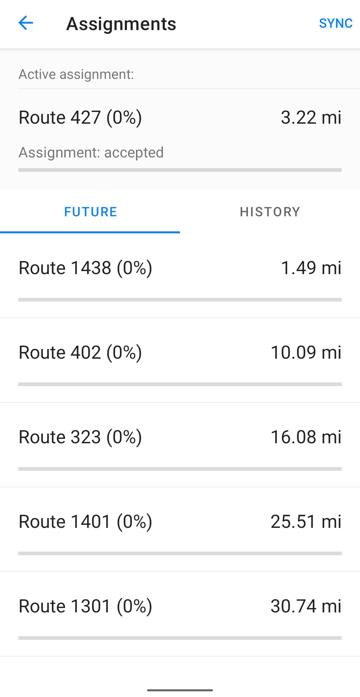

## Detached Mode

Detached Mode is an offline mode for the Driver App that is manually activated and can be used if a network outage is expected within the working area due to severe weather in order to retain completed work on in-progress assignments.

### Turn on the mode

To activate the Detached Mode, go to **Main menu > Settings > Detached Mode > Turn On**. 
The Device should be connected to the Internet to activate the Detached Mode.

Once activated, the app will download and cache the complete map of a working area as well as the user's assignment queue and routes data.

### Map view

After all data has successfully downloaded, the map layer on the home screen will be displayed as yellow.

### Offline work on Assignments

In the Detached Mode, a  driver can efficiently continue work on assignments without losing progress.

To synchronize all assignments, go to **Main menu > Assignments** and tap on the **SYNC** button.

The App will then download and synchronize all the assignments existing in the system, including planned assignments for future phases that have not yet been activated.

This allows the Driver to take control of his assignments. However, due to the lack of a connection, we recommend that all such work is coordinated and communicated with the Inspector/Supervisor by radio.

### Turn off the mode

To deactivate the Detached Mode, go to **Main menu > Settings > Detached Mode > Turn Off**. 

The Device should be connected to the Internet to deactivate the Detached Mode.

After detached mode is turned off, the App will upload and synchronize all updates and progress made while using the detached mode with online system data.
