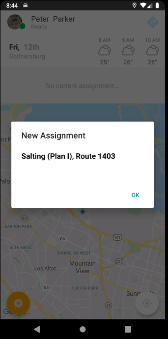
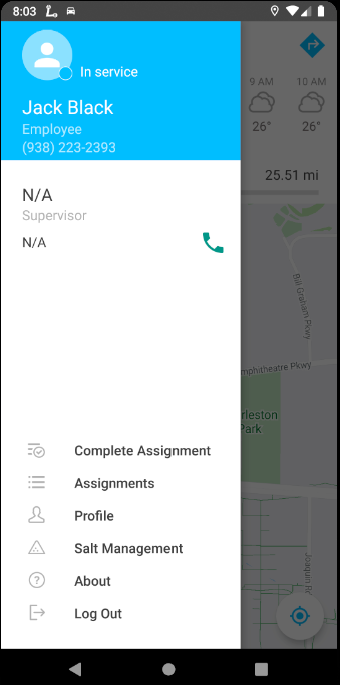
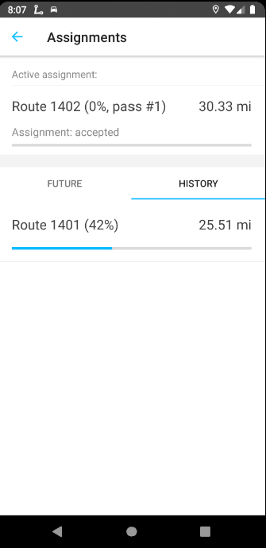
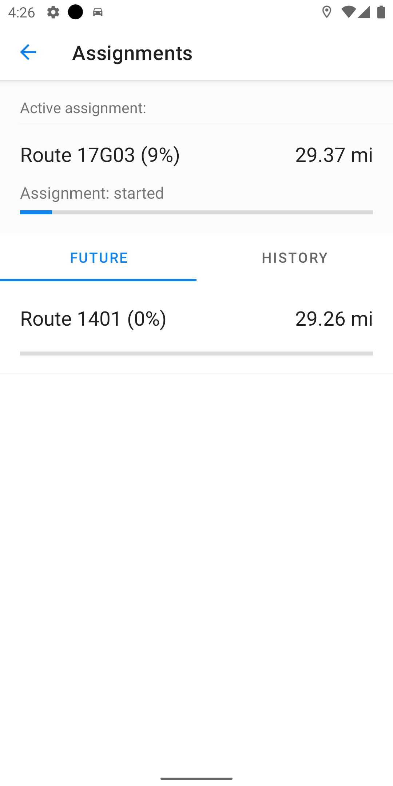
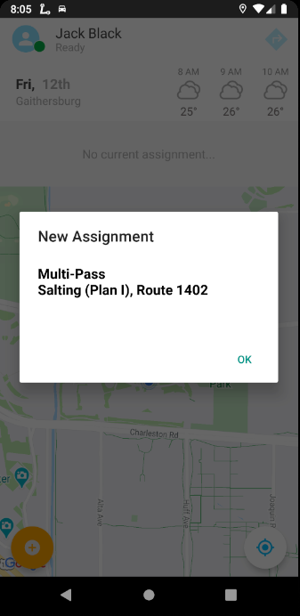
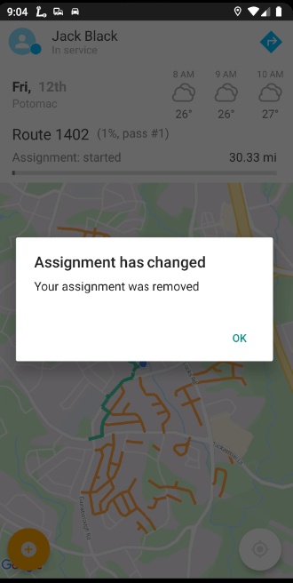
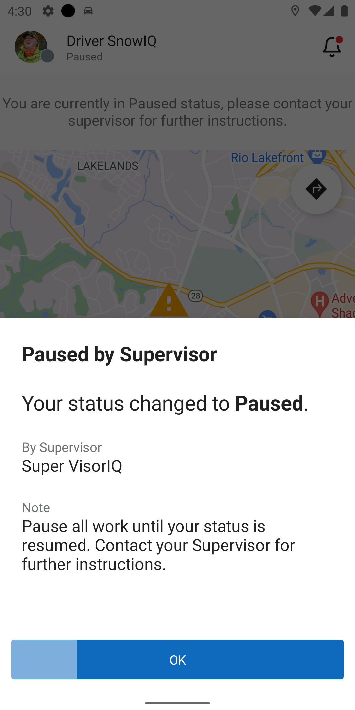

<section id="Drivers-Activity" markdown="1">
# Driver's Activity

<section id="Assignments" markdown="1">
## Assignments

<section id="Accepting-and-Working-Assignments" markdown="1">
### Accepting and Working Assignments
When a Supervisor assigns a route, a ticket, or an address-specific assignment, the Driver receives a notification as seen below. Press 'Ok' and follow the steps below:

- Get directions to the location of the assignment by using the navigate button in the app (the blue arrow icon in the top right corner), which opens Google Maps to provide directions. 
- Once the system starts tracking that the Driver is working on the assignment, i.e. the Driver's GPS location is on the assigned route or address, the system will change the status of the Active Assignment to 'Started' in the status bar and begin displaying breadcrumbs to indicate the route that was worked on, as shown below. 
- Alternatively, the Driver can manually go to the Navigation drawer and press 'Start Assignment' as seen below. 
</section>

<section id="Completing-Assignments" markdown="1">
### Completing Assignments
A Driver can complete their Active Assignment by opening the Navigation drawer and pressing 'Complete Assignment' as seen below.

This removes the assignment from the Status bar and also moves it from Active Assignments to the History tab in the 'Assignments' panel in the Operations Menu. If the Driver has another Assignment in the queue (in the 'Future' tab in the 'Assignments' panel), then the Driver will receive the notification as seen below and will follow the process as specified in the section "Accepting Assignments" above.

</section>

<section id="Completing-Multi-Pass-Assignment" markdown="1">
### Completing Multi-Pass Assignment
If a Driver receives an Assignment with Multi-pass toggled on, it will be indicated in the notification. Once the Driver completes a pass, they will press 'Complete Pass' in the Navigation drawer and will await further instructions from the supervisor as specified in the status bar as seen below. 
  - If a Supervisor chooses another pass for this assignment, the Driver will receive the following notification to proceed work on the multi-pass assignment until completed with the pass and repeat the steps as specified above.

  - If a Supervisor decides that no more passes are needed, the Assignment will be removed from the Driver's Active Assignments into the 'History' tab on the 'Assignments' panel. The status bar will be updated to await further instructions. 

</section>

<section id="PausedResumed-Assignment" markdown="1">
### Paused/Resumed Assignment
When a Supervisor pauses a Driver, the Driver's status changes to 'Paused' and the status bar is updated, as shown below. Once the Supervisor resumes the Driver, the previous Assignment is started again and the status returns to 'In Service.'

</section>
</section>
</section>
