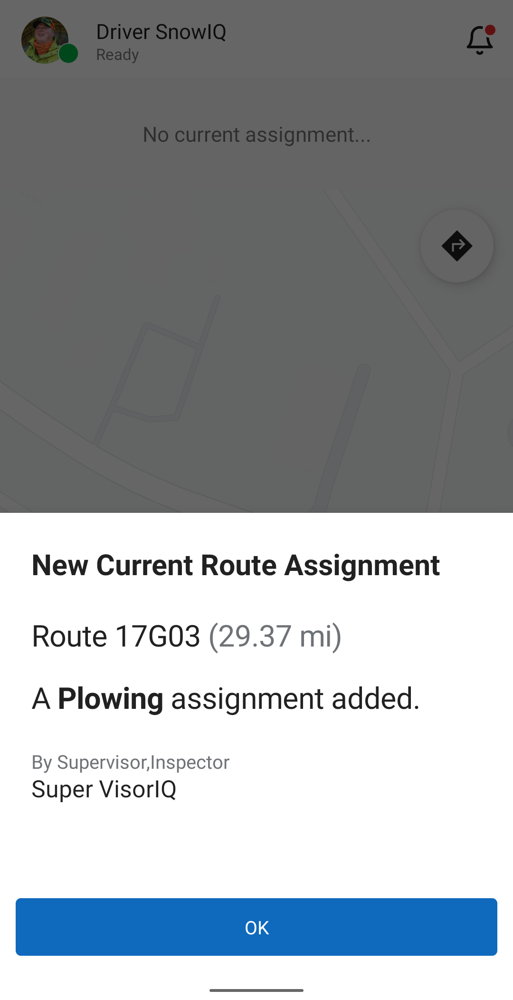
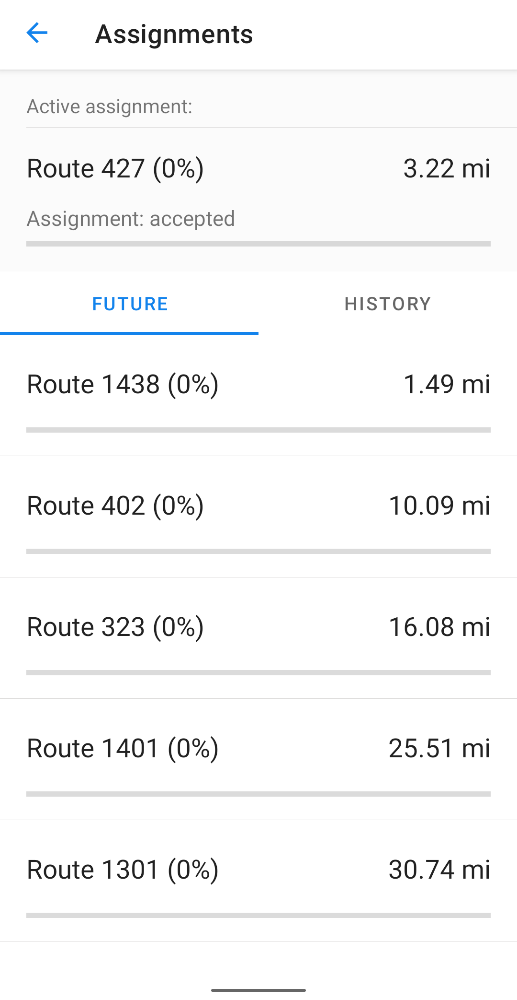
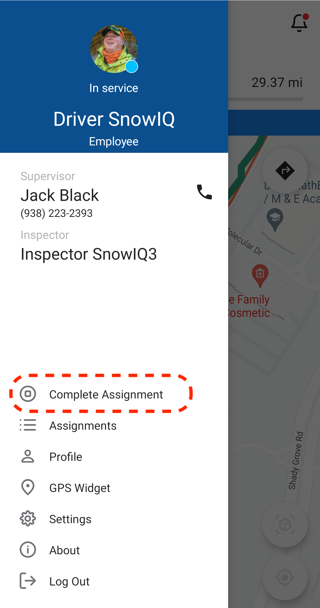
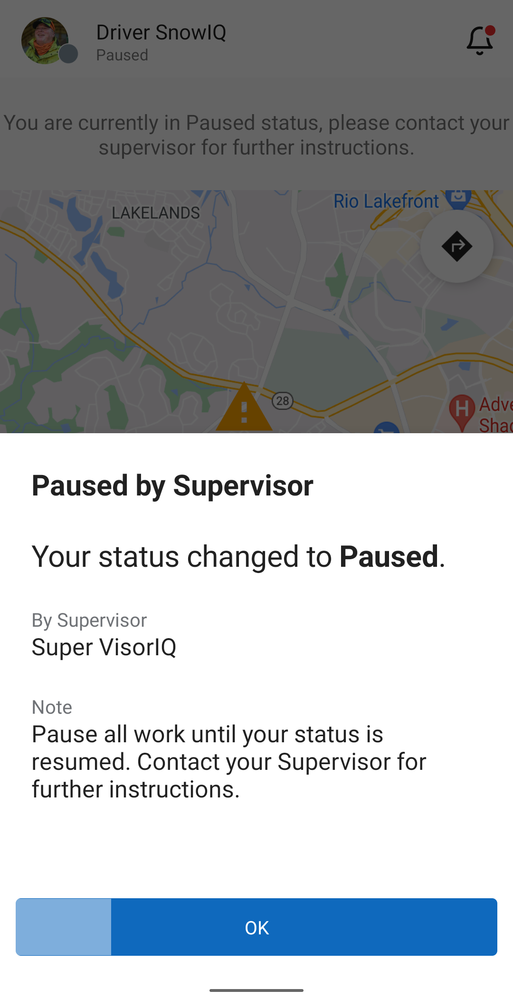

# Driver's Activity

## Working on Assignments

### Accepting Assignment

When a Supervisor assigns a route, ticket, or address-specific assignment, the Driver will receive a notification as pictured below. Select 'Ok' and do the following:

- Get directions to the location of the assignment by selecting the Navigate button in the app (the blue arrow icon in the top right corner). This will 
 open Google Maps to provide directions. 
- Once the system begins tracking a driver's assignment per the Driver's GPS location, the system will change the status of the Active Assignment to 'Started' in the status bar and begin displaying breadcrumbs that indicate the route being worked on, as shown below. 
- Alternatively, the Driver can manually go to the Navigation menu and select 'Start Assignment'.

### Assignments Menu

The driver app has an Assignments menu, which contains a list of current, future and historical assignments.

To display the Assignments manu, select Assignments in the main menu.

### Completing Assignments

A Driver can complete their Active Assignment by selecting the Navigation menu and then selecting 'Complete Assignment', as shown below.

This removes the assignment from the Status bar and also moves it from Active Assignments to the History tab in the 'Assignments' panel in the Operations menu. If the Driver has another Assignment in the queue (which would be displayed in the 'Future' tab in the 'Assignments' panel), then the Driver will receive the notification as shown below, and the Driver can then follow the process as described in the "Accepting Assignments" section above.

### Completing Multi-Pass Assignment

If a Driver receives an Assignment with Multi-pass toggled on, the Driver will receive a notification. When the Driver completes a pass, they will select 'Complete Pass' in the Navigation menu and can then await further instructions from the supervisor as specified in the status bar, as shown below. 
  - If a Supervisor adds another pass for an assignment, the Driver will receive the notification shown below to proceed work on the multi-pass assignment until it is completed, repeating the above steps for each pass.

  - If a Supervisor determines that no addditional passes are needed, the Assignment will be removed from the Driver's Active Assignments and will then be displayed in the 'History' tab on the 'Assignments' panel. The status bar will be updated to alert the driver to wait for any further instructions. 

### Pause/Resume Assignment

When a Supervisor pauses an Assignment, the Driver will receive the following notification:

