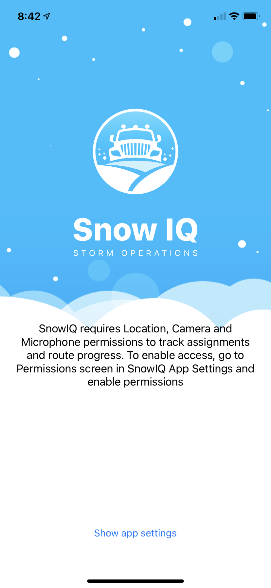

# Installing the Driver App

The app, titled "SnowIQ Driver," can be found on both the <a href="https://play.google.com/store/apps/details?id=com.eastbanctech.transitiq.snowtrax&hl=en_US&gl=US">Google Play</a> and <a href="https://apps.apple.com/us/app/snowiq-driver/id1336056235">Apple App Store</a>. It is published by EastBanc Technologies. In order to use the app, navigate to the app's page on the App Store and download the app.

Once you have navigated to the app store, hit the "GET" button and wait for the app to download. Once it has downloaded, navigate to your phone's home screen. There, you will find the SNOWiQ Driver app. 

Tap the icon on your home screen to open the app. Upon opening the app, you will be asked for permission to access your location, camera and microphone. In order to proceed, you must give the app these permissions. After giving these permssions, you will be able to login.

Note:
Links
Entire installation process
Setup process with permissions prompts
