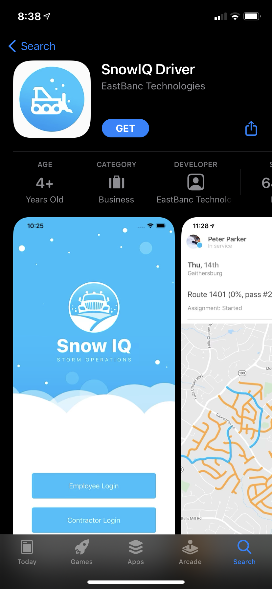
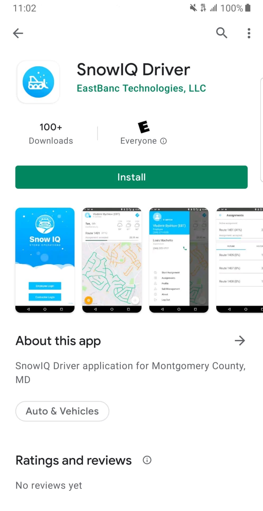
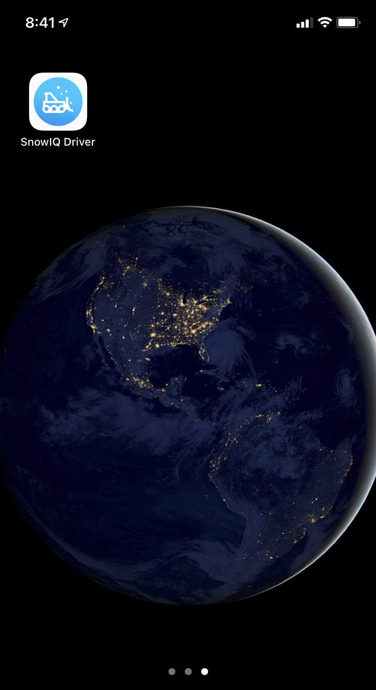
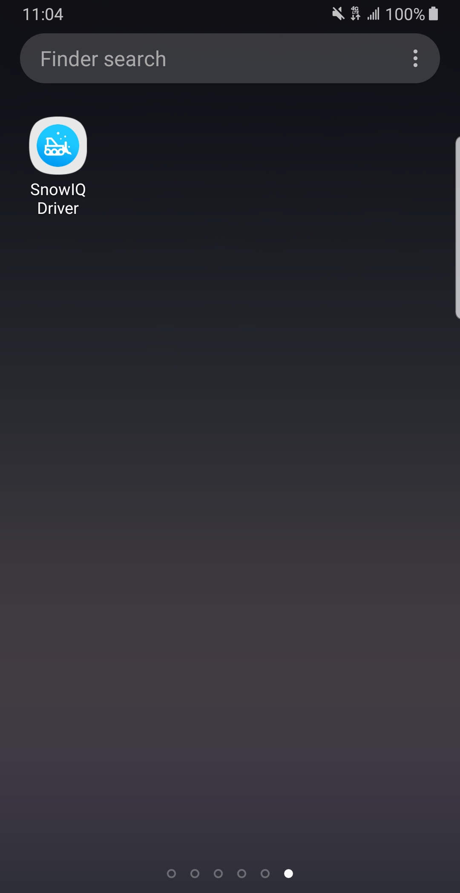
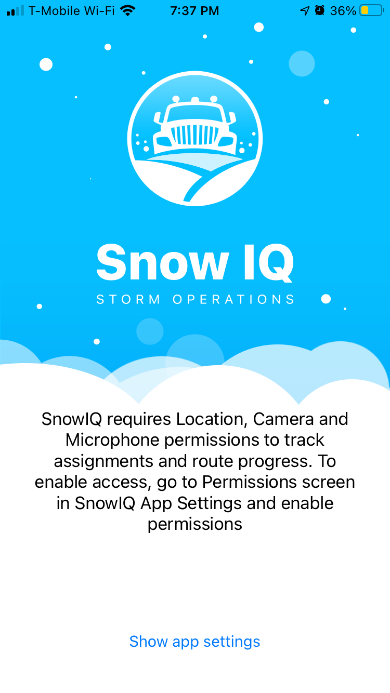

<section id="Installing-Driver-App" markdown="1">
<h1>Installing Driver App - AndroidiOS</h1>
**To see AndroidiOS specific content, click the Platform dropdown and select AndroidiOS.**

The iOS app, titled "SnowIQ Driver," is available on the <a href="https://apps.apple.com/us/app/snowiq-driver/id1336056235">App Store</a>. It is published by EastBanc Technologies. In order to download the app, navigate to the app's App Store page by using the App Store's search feature or clicking the link above.

The Android app, titled "SnowIQ Driver," is available on the <a href="https://play.google.com/store/apps/details?id=com.eastbanctech.transitiq.snowtrax&hl=en_US&gl=US">Google Play Store</a>. It is published by EastBanc Technologies. In order to download the app, navigate to the app's Google Play Store page by using the Play Store's search feature or clicking the link above.

<section id="Download" markdown="1">
## Download

Once you have navigated to the app's App Store page, hit the "GET" button, confirm with password or Touch/ Face ID if prompted, and wait for the app to download. Once it has downloaded, the app will show up in your phone's app library or on its home screen.

Once you have navigated to the app's Play Store page, hit the "Install" button, follow the prompts, and wait for the app to download. Once it has downloaded, the app will show up in your phone's app library or on its home screen.

</section>

<section id="Set-up-and-Permissions" markdown="1">
## Set-up and Permissions

Tap the app icon to open the app. Upon opening the app, you will be asked for permission to access your location, camera, and microphone. In order to proceed, you must give the app these permissions. After giving these permssions, you will be able to login.

</section>
</section>
