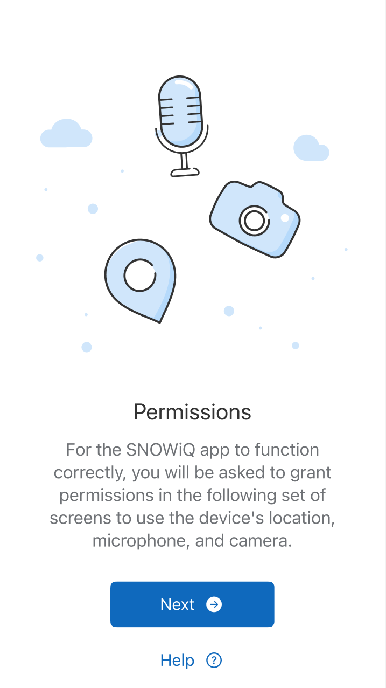
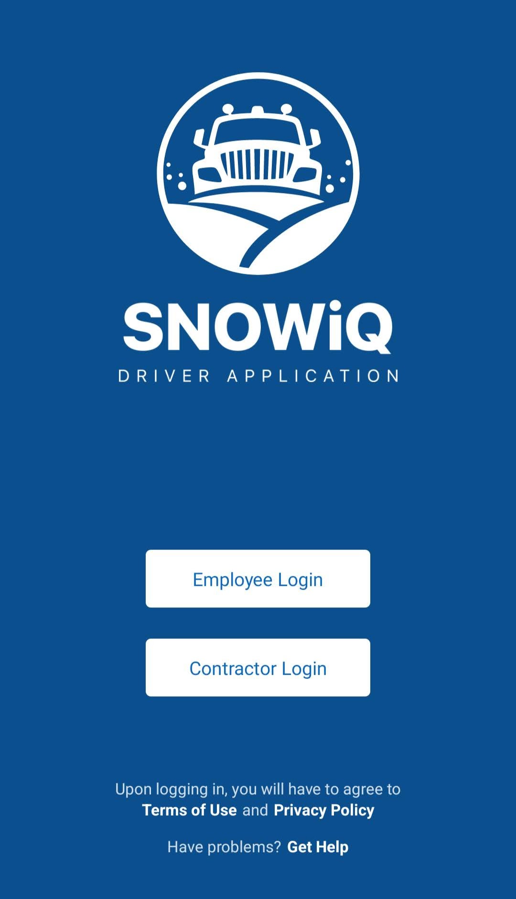
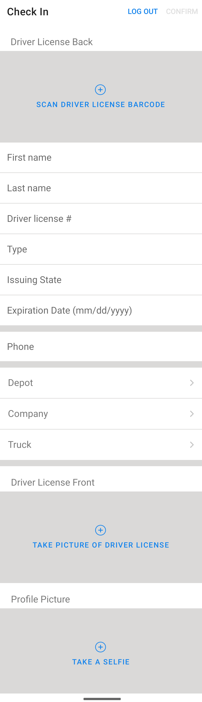
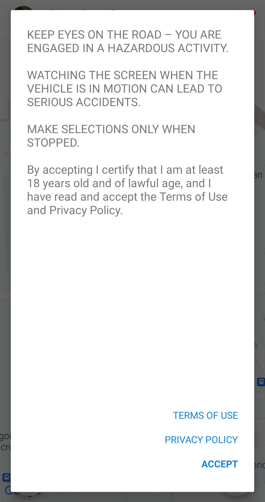

## Permissions

Tap the app icon to open the app. Upon opening the app, you will be asked to grant permission to access your location, camera, and microphone. In order to proceed, you must give the app these permissions. After giving these permssions, you will be able to login.

## Log In

The login screen below allows Driver users to enter the SNOWiQ Driver Application (DA). Click the appropriate 'Login' button to be re-routed to enter the assigned username and password for the application.

## Check-In

After successfully logged in user will be asked to carefully fill out all the fields of the Check-in form.

After user submitted the form, a check-in request sent to a Supervisor for review.

## Consent

And the last, but not least step - user have to read and accept the Terms of Use and Privacy Policy.

After you read everything, tap ACCEPT button and you will have full access to Driver App functionality.