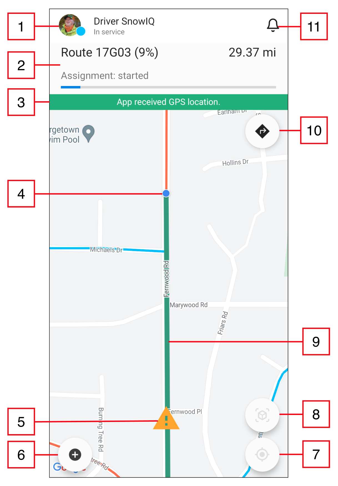
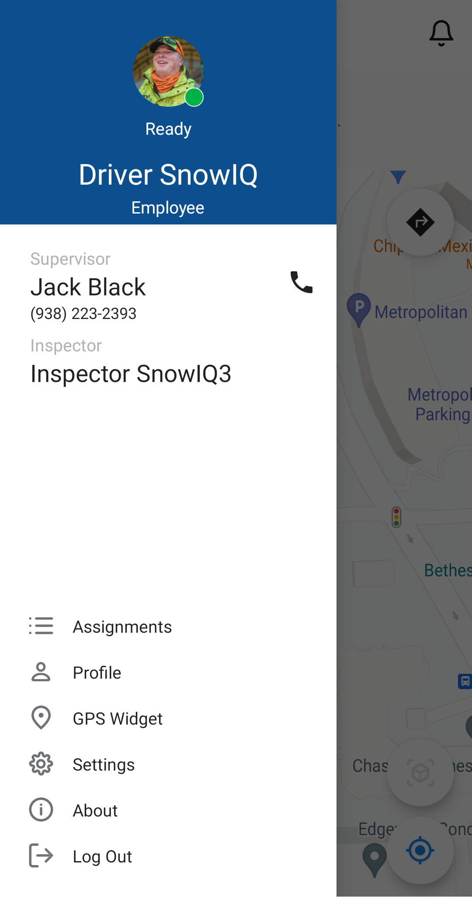
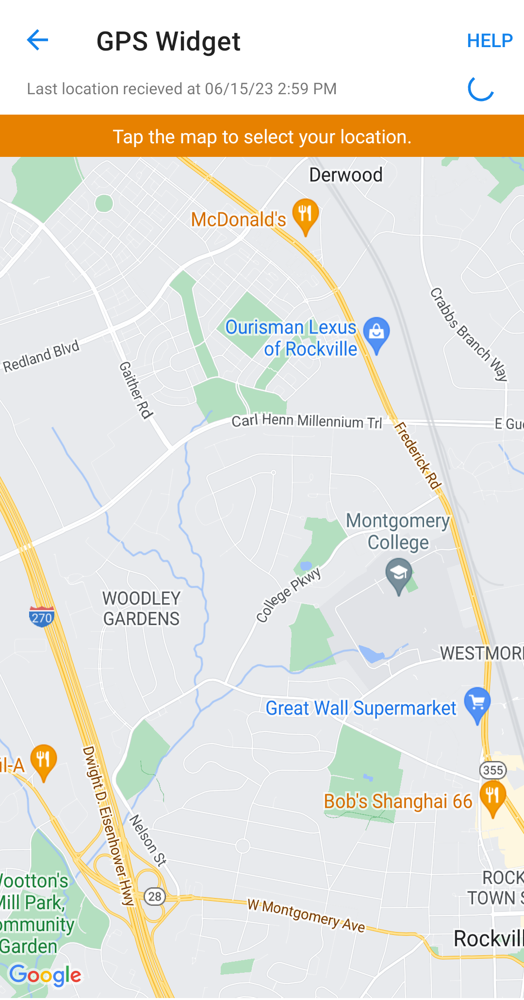
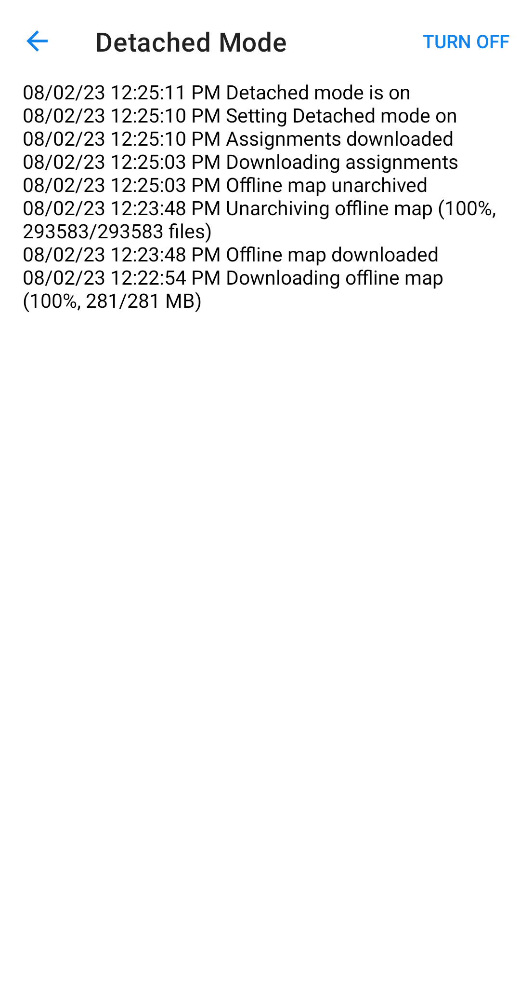
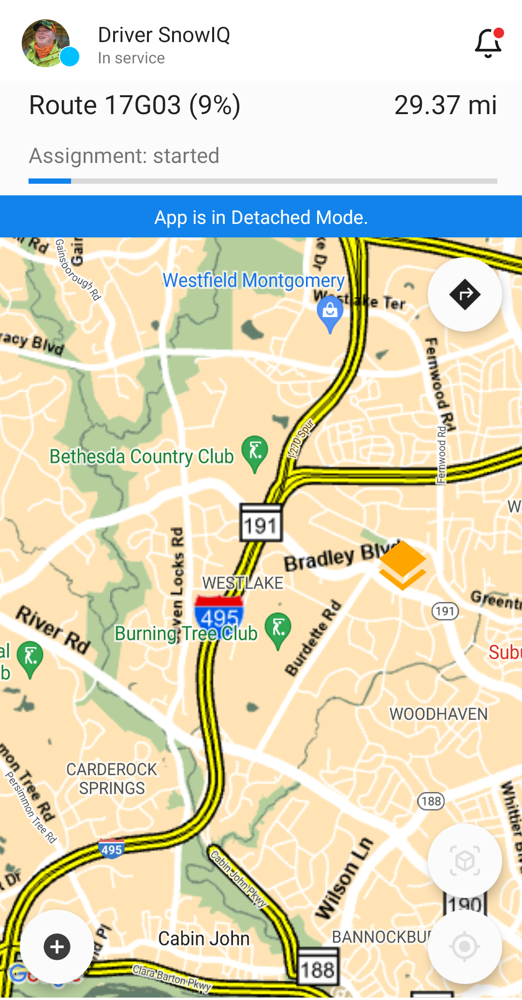
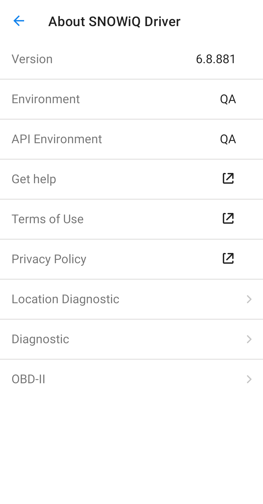

After successfully setup the application user will have full access to Driver App features and functionality.

<section id="Home-Screen" markdown="1">

## Home Screen

The diagram below highlights basic navigation controls and map elements of the Driver App.

| 1 | User Profile Picture, Name, and Status – pressing on the Profile picture opens the Navigation Drawer|
| 2 | Assignment status and progress bar |
| 3 | Message banner – Displays important information like GPS issues, etc. |
| 4 | Map |
| 5 | Current device location on the map |
| 6 | Button to create Road Hazards |
| 7 | Center map to the current location |
| 8 | 3D Map Mode |
| 9 | Breadcrumbs appear in near-real time over the Route that the Driver has worked on already. |
| 10 | Road hazard marker |
| 11 | Navigate button to get directions to the assignment from Google/Apple Maps |
| 12 | Notifications screen |

<section id="Main-Menu-Panel" markdown="1">

## Main Menu Panel

Users can open the Main Menu Panel by pressing the User Profile picture icon as specified in the diagram above. 

The panel contains 3 sections:

| 1 | User Profile Details | This section lists the profile details of logged in driver. To edit them, the user can press 'Profile' in the section below. |
| 2 | Supervisor Details | Each driver has a Supervisor they report to and who assigns them work. The Supervisor's name and phone number are listed in this section, with the ability to contact the Supervisor directly from within the app, by pressing the green phone icon. |
| 3 | Operations Menu | The Operations Menu as seen above is for a Driver without any active or future assignments. If a driver receives an assignment or needs to complete an active assignment, an actionable option will be added to the menu, which can be seen here. |

</section>

<section id="User-Profile" markdown="1">

## User Profile

A user can press on 'Profile' to edit user name, phone number, and profile picture.

</section>

<section id="GPS Widget" markdown="1">

## GPS Widget

Screen to verify your location and calibrate GPS on the device.

</section>

<section id="Detached-Mode" markdown="1">

## Detached Mode

Detached Mode is  offline mode for the Driver App, which can be manually activated in case of network outage is expecting within the working aria due to severe weather.

To access and activate the Detached Mode, go to Main menu > Settings > Detached Mode > Turn On. 
Device should be connected to the Internet to activate the Detached Mode.

Once activated, the app will download and cache the complete map of working aria. Also app will download complete user's assignment queue and complete route data (including segments).

After all data successfully downloaded and set map layer on the home screen change color to yellow and driver can continue work on assignments.

</section>

<section id="About" markdown="1">

## About

Displays the current version of the app.

</section>

<section id="Logout" markdown="1">

## Logout

A user must logout at the end of each workday.

</section>

</section>