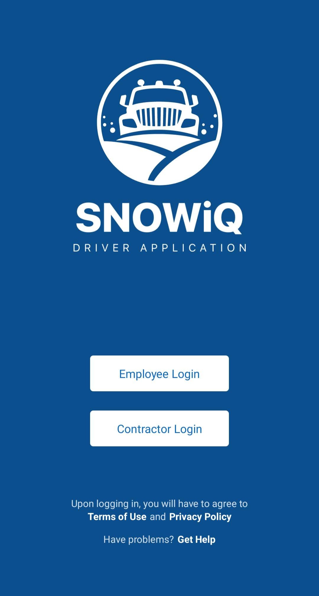
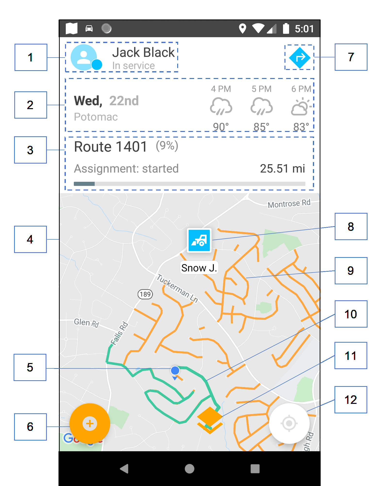
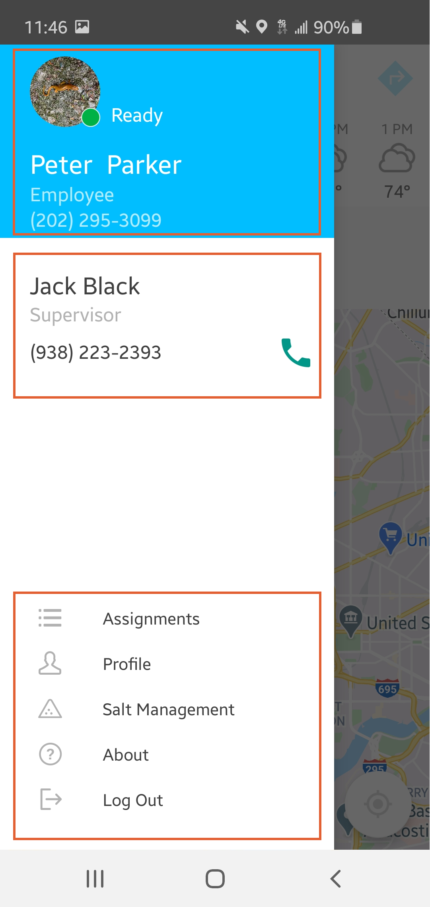
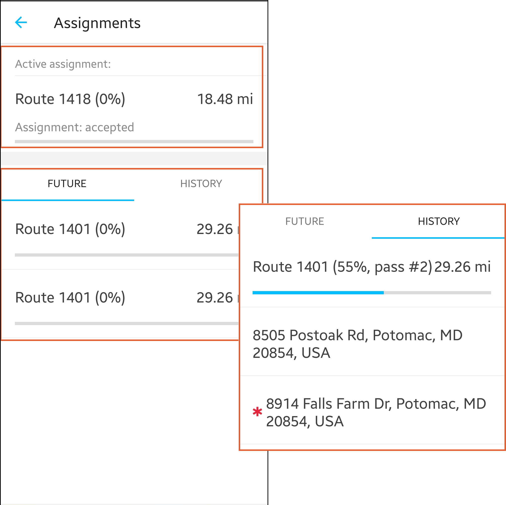
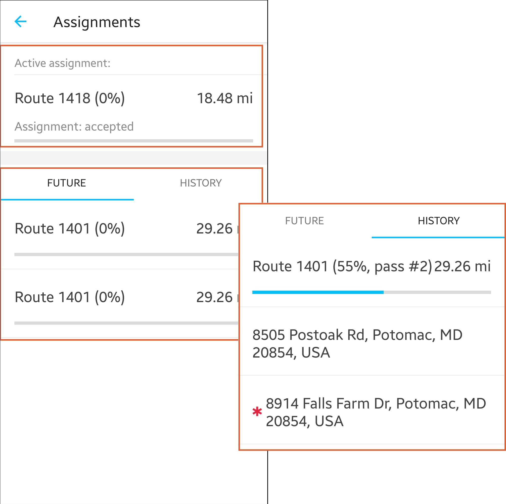
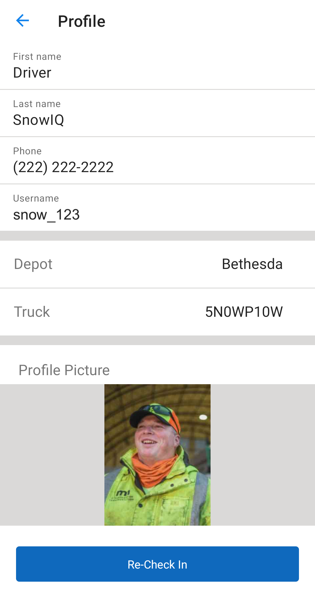
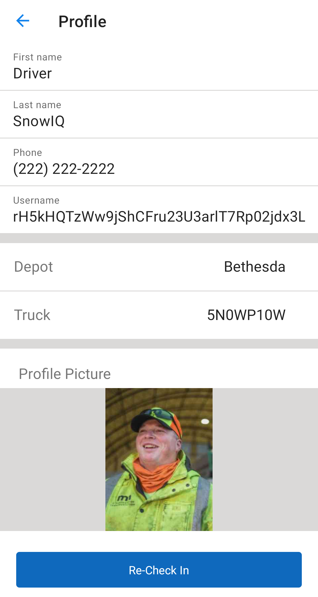

<section id="Login-and-Navigation" markdown="1">
# Login and Navigation

<section id="Login" markdown="1">
## Login
The login screen below allows Driver users to enter the SNOWiQ Driver Application (DA). Click the appropriate 'Login' button to be re-routed to enter the assigned username and password for the application.

Once logged into the DA, Drivers will see the screens display two types of Drivers logged in, a County Driver and a Contractor. The difference is identified in the status of the Driver. The County Driver, on the left, has a status of 'Ready' whereas the Contractor, on the right, is in 'Standby.' The circle next to the profile picture indicates that this a County Driver and a square indicates a Contractor. These icons are color coded to match the status.

</section>

<section id="Navigation" markdown="1">
## Navigation
The diagram below highlights basic navigation controls and map elements of the Driver App.

1. User Profile Picture, Name, and Status – pressing on the Profile picture opens the Navigation Drawer 
2. Status bar  
   * If it is on active assignment, as seen in this diagram, the status bar includes the route number or address being worked, number of miles on the assignment, percentage completed, status of the assignment, and progress bar

   * If it is in between assignments or no assignments, the system will display the appropriate notification to the user. 
3. Message banner – Displays important information like GPS issues, etc.
4. Map – based on the TBD
5. Current device location on the map
6. Button to create Road Hazards
7. Center map to the current location
8. 3D Map Mode
9. Route segments assigned to the Driver to work on. Routes are represented by different types of route segments: 
    * Emergency - red
    * Primary - blue
    * Neighborhood - orange
    * Breadcrumbs (green colored) appear in near-real time over the Route that the Driver has worked on already 
10. Road hazard marker
11. Navigate button to get directions to the assignment from Google/Apple Maps
12. Notifications screen

<section id="Navigation-Drawer" markdown="1">
### Navigation Drawer
Users can open the Navigation Drawer by pressing the User Profile picture icon as specified in the diagram above. The panel is divided into three sections:

<section id="User-Profile-Details" markdown="1">
#### User Profile Details
This section lists the profile details of logged in driver. To edit them, the user can press 'Profile' in the section below.
</section>

<section id="Supervisor-Details" markdown="1">
#### Supervisor Details
Each driver has a Supervisor they report to and who assigns them work. The Supervisor's name and phone number are listed in this section, with the ability to contact the Supervisor directly from within the app, by pressing the green phone icon.
</section>

<section id="Operations-Menu" markdown="1">
#### Operations Menu
The Operations Menu as seen above is for a Driver without any active or future assignments. If a driver receives an assignment or needs to complete an active assignment, an actionable option will be added to the menu, which can be seen here.

</section>
</section>

<section id="Assignments" markdown="1">
### Assignments
A user can press on 'Assignments' to view the Active Assignment, if there is one, any Future Assignments in the queue, and the History of assignments the driver worked on.

</section>

<section id="Profile" markdown="1">
### Profile
A user can press on 'Profile' to edit their name, phone number, and User Picture.

</section>

<section id="GPS Widget" markdown="1">
### GPS Widget
Screen to verify your location in calibrate GPS on the device.
</section>

<section id="About" markdown="1">
### About
Displays the current version of the app.
</section>

<section id="Logout" markdown="1">
### Logout
A user must logout at the end of each workday.
</section>
</section>
</section>
