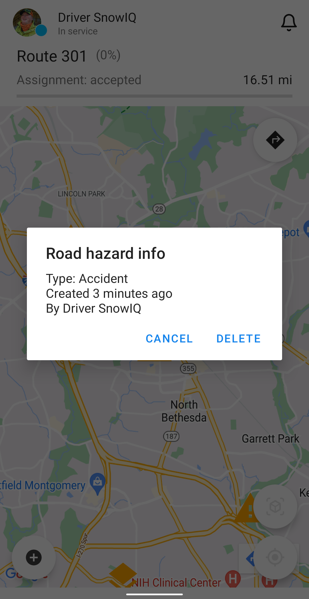
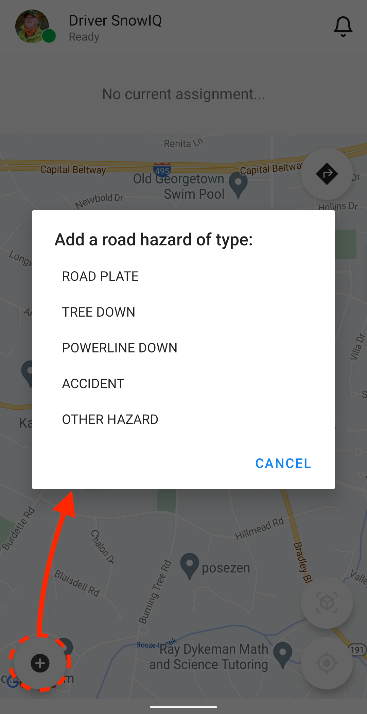
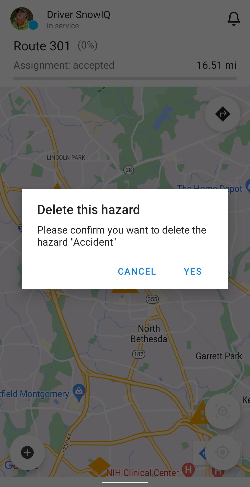

<section id="Road-Hazards" markdown="1">

# Road Hazards

Road Hazard is a marker icon on the map to warn system users.

It is especially important for drivers to know that there is might be a hazards on their way.

<section id="Creating-Road-Hazards" markdown="1">

## Creating Road Hazards

To create a Road Hazard from the Driver App:
  - On the map, tap the road hazard plus icon
  - The system will display the 'New road hazard' prompt shown below

  - Choose the type of road hazard from the list and press 'Yes' to confirm

  - The system will display the hazards as either a road plate or a warning as seen below
    - Road plates (orange stacked layers marker): permanent hazard on the road
    - Temporary hazard (orange warning triangle marker): tree down/power line down, accident, etc.

**Note:** These hazards will appear on the map for all Supervisors and Drivers that are working in the same service area.

</section>

<section id="Deleting-Road-Hazards" markdown="1">

## Deleting Road Hazards

A road hazard can be manually deleted when it is resolved, outdated or doesn't exist anymore.

To delete a marker:
  - Tap on an existing road hazard on the map
  - The system will display 'Road hazard info' window
  - Tap 'Delete' and confirm 'Yes' on the next prompt

Once deleted, the marker will be removed from the map for all the system users.

</section>
</section>