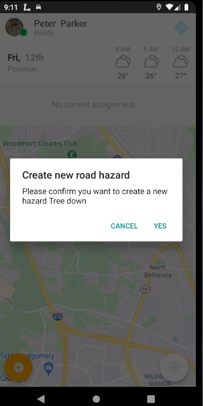

<section id="Road-Hazards" markdown="1">
# Road Hazards

<section id="Creating-Road-Hazards" markdown="1">
## Creating Road Hazards
A Driver can create a road hazard on the map to warn other Drivers of the hazards on their routes, by following the steps below:
  - On the map, press the road hazard plus icon
  - The system will display the 'New road hazard' prompt shown below
  - Choose the type of road hazard from the list and press 'Yes' to confirm the creation of a new road hazard on the next prompt
  - The system will display the hazards as either a road plate or a warning as seen below
    - Road plates (orange stacked layers marker): permanent hazard on the road
    - Temporary hazard (orange warning triangle marker): tree down/power line down, accident, etc.
    
       **Note:** These hazards will appear on the map for all Supervisors and Drivers that are working in the same service area

</section>

<section id="Deleting-Road-Hazards" markdown="1">
## Deleting Road Hazards
A Driver can delete an existing road hazard from the map if it doesn't exist anymore: 
  - Press on an existing road hazard on the map
  - The system will display the following 'Road hazard info' prompt
  - Press 'Delete' and press 'Yes' on the next prompt to confirm deletion of the road hazard
  - Once deleted, the marker is removed from the map for everyone

</section>
</section>
