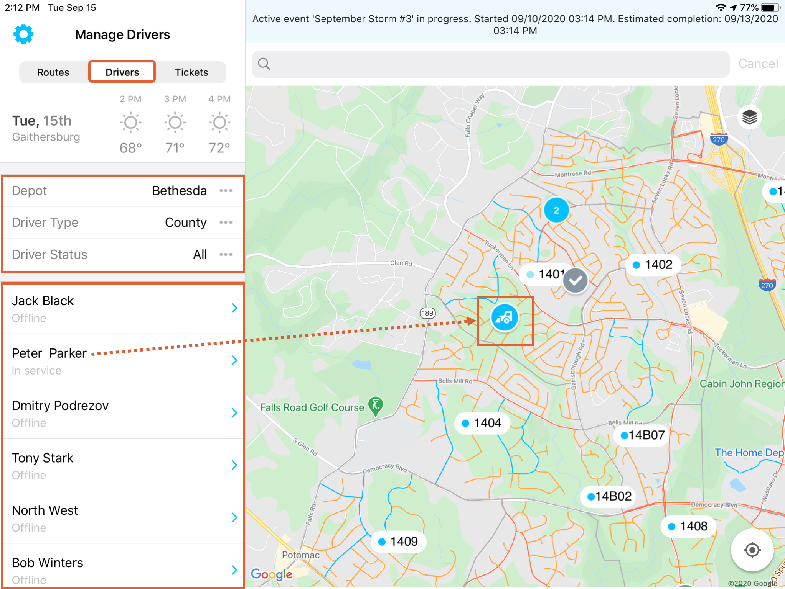
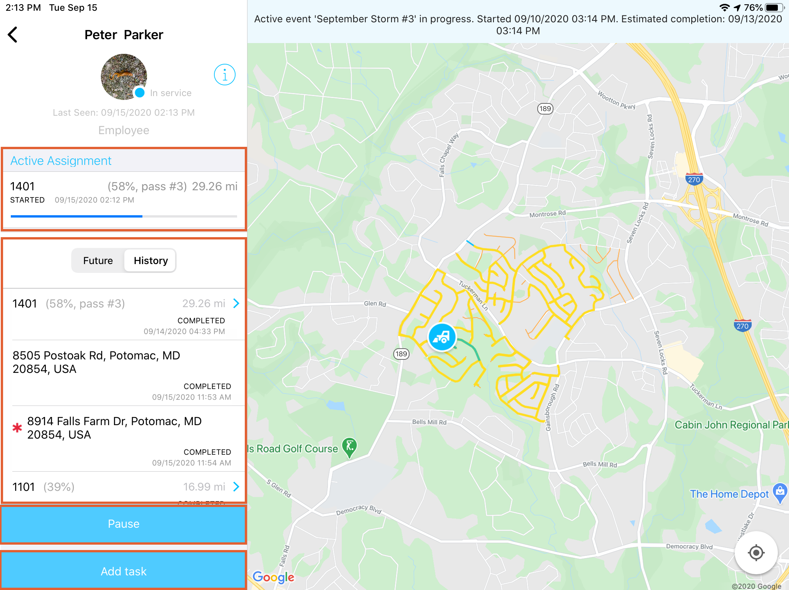
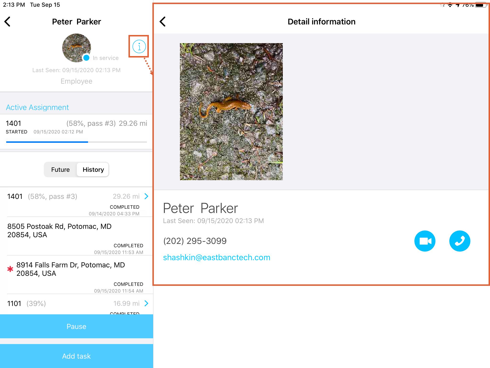

<section id="Drivers-Tab-View" markdown="1">
# Driver's Tab View

The Drivers panel displays a list of drivers active in the system with their names and current statuses. The driver marker is displayed on the map (color coded based on status). Above the list there is a set of filters: by Depot, Route Type, and Route Status. Pressing on the name of the driver in the panel on the left takes the user to the [Driver Details](#Driver-Details)

Pressing on the driver marker on the map (the snowplow icon) produces a prompt on the map with additional driver details, as seen below. Pressing on the name in the prompt takes the user to the **Driver Details panel**

<section id="Drivers-Filters" markdown="1">
## Drivers Filters

Using the filters above the drivers list allows users to narrow down what is seen on the map. Setting a filter can add or remove map elements such as driver types or drivers with different statuses. The filters and their options are listed below:

<section id="Depot" markdown="1">
### Depot

The depot filter defaults to the depot the Supervisor is assigned to and only the drivers associated with that depot will be displayed. 
</section>

<section id="Driver-Type" markdown="1">
### Driver Type

The Route Type filter allows users to filter by County or Contractor employees. County employees can be found on the map with a circular snowplow marker  while contractors will be found with a square marker .
</section>

<section id="Driver-Status" markdown="1">
### Driver Status

The Driver Status filter allows users to view drivers with a specific status only.

* Logged in (Contractor Only) –  is for Contract Drivers who have logged into the system, but have not accepted any new assignments or working on any active assignments. This status is for drivers awaiting a new status after logging in. (This status means no payment is being calculated for the driver, whether they just logged on or have been released.)
* Standby (Contractor Only) – is for Contract drivers who are in position, awaiting assignment. This status is applied manually to a driver by their supervisor. (This status allows for calculation of payment by half of their rate.)   
* Ready – is the default status for County Drivers after logging on. For Contract Drivers, it is applied manually by their supervisor to indicate that the driver is ready to begin work on another assignment. (This status allows for calculation of payment in the Contract Driver's full rate.)
* Address Assignment – is for Drivers working on an address specific assignment.
* In Service – is for Drivers who have accepted and started an assignment on a route.
* Paused  – is for when a supervisor manually pauses a driver. This puts all assignments in the driver's queue on hold until the Supervisors resumes the driver manually. 
* Offline  – is for users that are not logged into the SNOWiQ Driver Application, drivers that are out of range of the service area (out of range), or any drivers that are not able to broadcast/receive GPS coordinates to the system (out of service).
</section>
</section>

<section id="Driver-Details" markdown="1">
## Driver Details

The Driver Details panel focuses on one selected driver both on the map and on the left-hand panel and all the details associated with that driver: Active Assignments, if any, and their progress, history of previous assignments and future ones. Here, the Supervisor is also able to 
1. 'Pause' (or 'Resume' not shown) an Active Assignment, which would notify the Driver in the Driver App that their Assignment has been paused.  
1. 'Add Task' to the selected Driver, which would notify the Driver in the Driver App. 

Clicking on the 'i' (information) icon produces the 'Detail information' profile page of the driver with the driver's contact information, as seen below:

</section>
</section>