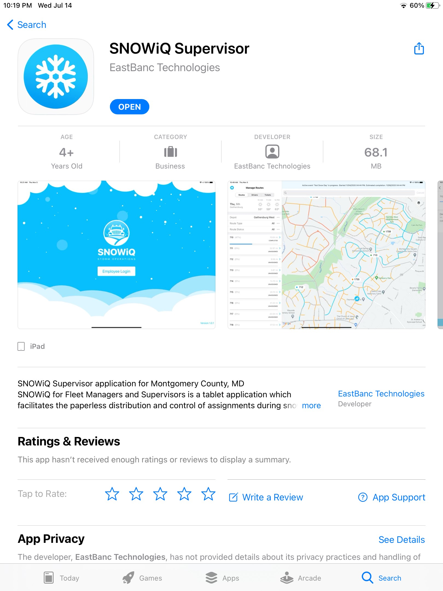
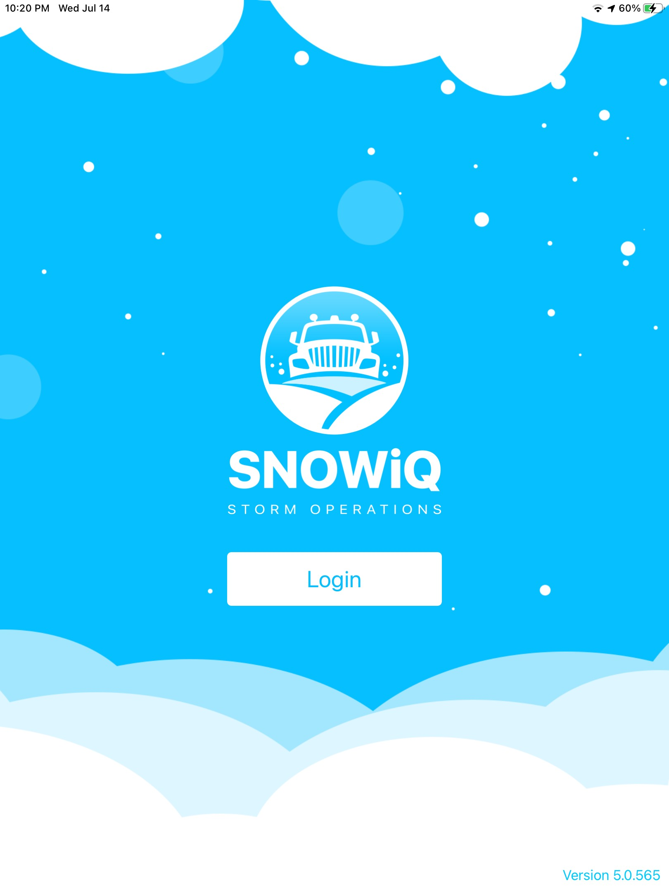

<section id="Installing-Supervisor-App" markdown="1">
# Installing Supervisor App

The app titled "SnowIQ" Supervisor is available only on the <a href="https://apps.apple.com/us/app/snowiq-supervisor/id1537419881">Apple App Store</a> for iPads. It is published by EastBanc Technologies. In order to use the app, navigate to the app’s page on the App Store and download the app.

<section id="Download" markdown="1">
## Download

Once you have navigated to the app store, hit the "GET" button and wait for the app to download. Once it has downloaded, navigate to your iPad's home screen. There, you will find the SNOWiQ Supervisor app. 

<section id="Login" markdown="1">
## Login

Tap the icon on your home screen to open the app. Upon opening the app, you will be asked to login. Enter your credentials to proceed.

