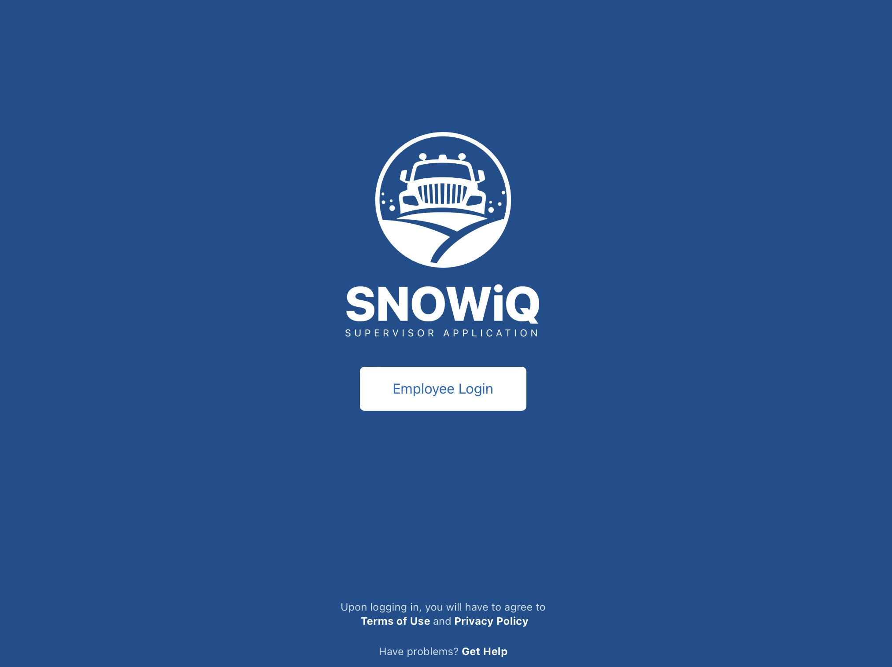

<section id="Login-and-Navigation" markdown="1">
# Login and Navigation

<section id="Login" markdown="1">
## Login

The login screen below allows a Supervisor user to access
the SNOWiQ Supervisor Application. Click the 'Login' button
to be re-routed to enter the assigned username and password
for the application.

Once logged into the Supervisor App, the Map Monitoring view will be displayed.
Note: A Supervisor assigned to a specific depot will only see routes associated
with that depot.

</section>

<section id="Navigation" markdown="1">
## Navigation
 
The diagram below highlights basic navigation controls and map elements of the Supervisor App 

 
1. Main Menu - Navigate to the Menu and Settings
2. Tabs - Switch between available tabs, including Routes, Resources, Tickets, or Inspectors
3. Weather widget - View weather conditions automatically updated based on location
4. Filter options - Filter options based on the selected tab
5. View a list of Routes, Resources or tickets based on the selected tab and any applied filters
6. View user's location on the map by selecting the "Find my location on the map" button 
15. Map layer button - Displays a panel to select different map layers (marker or segments displayed on the map)
16. Search bar - Search an address on the map to create address assignments
17. Storm Event banner - Displays active event estimates. Selecting the banner opens up the Event Log

<section id="Main-Menu" markdown="1">
### Main Menu
 
Users can navigate to the Settings Menu by selecting the 'Gear' icon as specified in the diagram above. A menu opens to the 'My Profile' page automatically. The following menu options are available:

</section>

<section id="My-Profile" markdown="1">
#### My Profile
 
A user can edit their  profile by selecting 'Edit Profile' in the top right corner, as shown above above. This allows the user to edit their information including name, phone number and email.
</section>

<section id="About" markdown="1">
#### About
 
Displays the current version of the app.
</section>

<section id="Event-Log" markdown="1">
#### Event Log
 
The Event Log allows a Supervisor to view details of user actions and timestamps of those actions actions for a current, active Event. The log displays the time the action occurred in the system, what the action was, and who performed the action (username or system). Actions may include creating an Assignment or activating a new Phase for a Depot.

</section>

<section id="Map-Layers" markdown="1">
### Map Layers
 
A user can access the Map Layers panel by pressing the Map Layers icon on the map (the stack of layers icon as shown below). By selecting the elements from the panel, a user can specify the markers or segments to be displayed on the map, based on any filters selected in the left-hand panel.

</section>

<section id="Clusters" markdown="1">
### Clusters
 
On the Map Monitoring view, when a user zooms out, markers are displayed with numbers inside them appear called 'clusters' that de-clutter the map and group together as markers. Clicking on a cluster allows to user to zoom in on that area and view the separated markers on the map.
</section>
</section>
</section>
