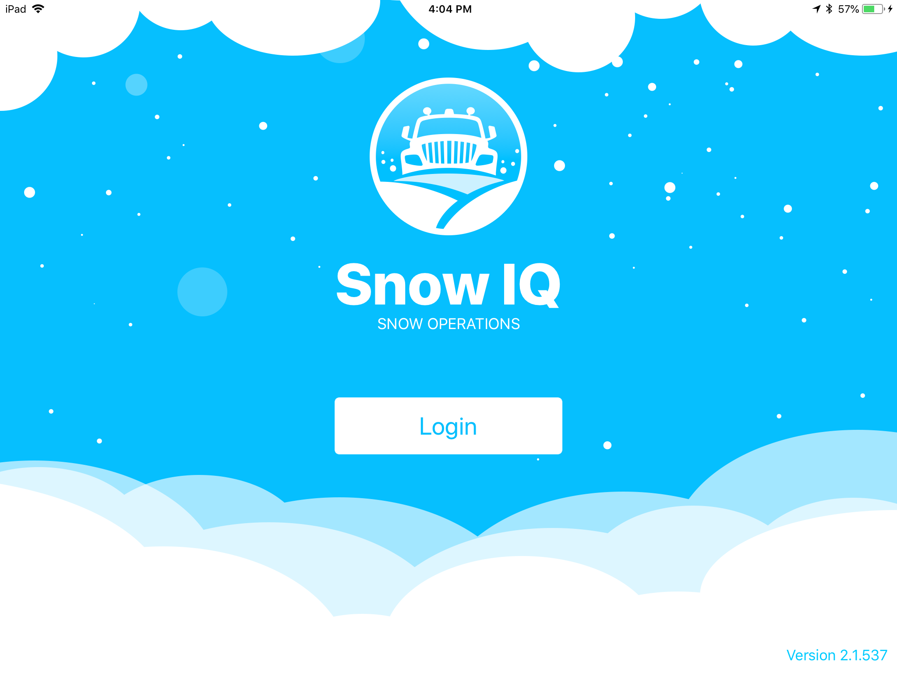
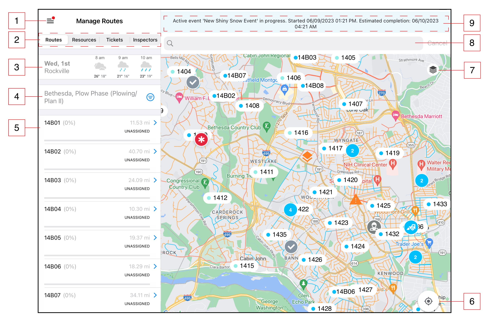
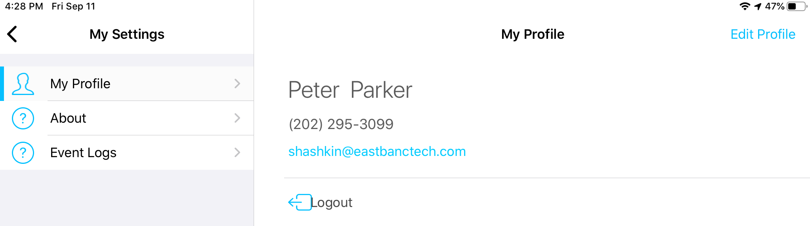
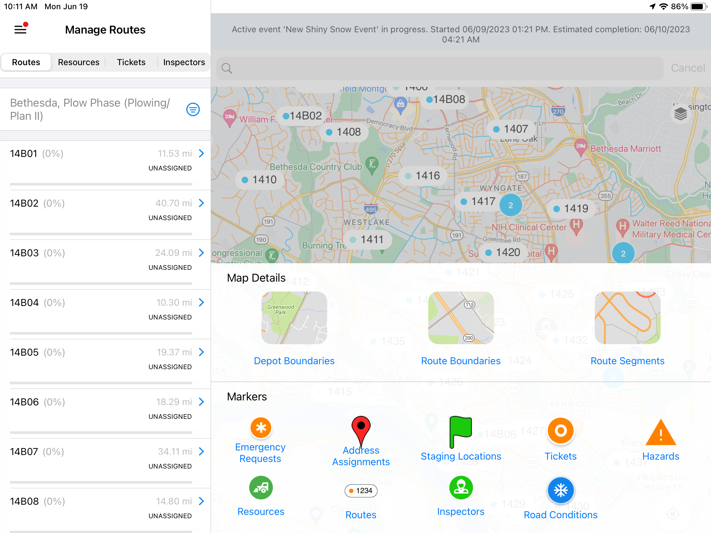
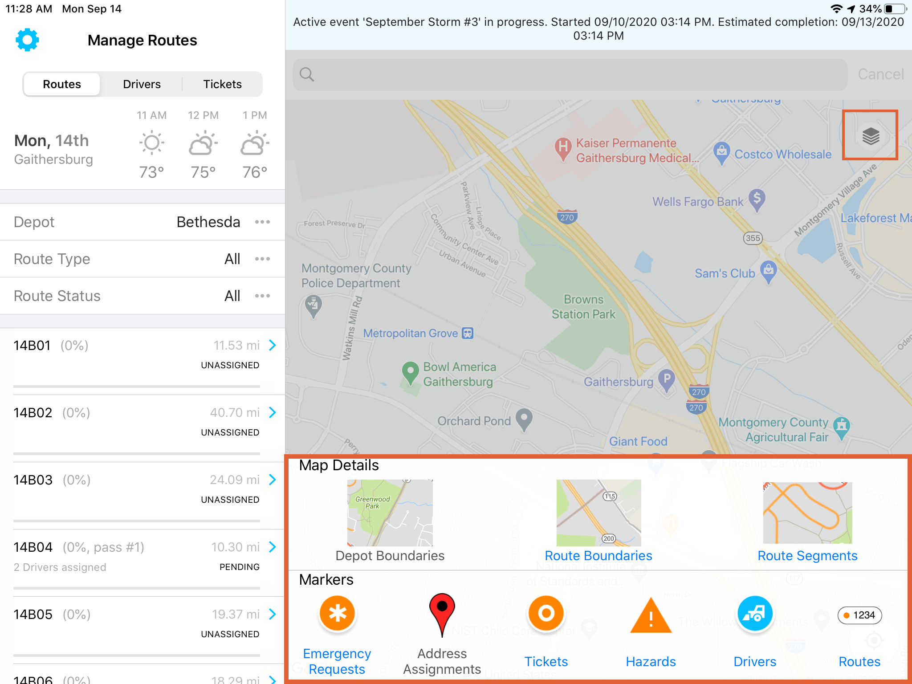

<section id="Login-and-Navigation" markdown="1">
# Login and Navigation

<section id="Login" markdown="1">
## Login

The login screen below allows Supervisor users to enter into
the SNOWiQ Supervisor Application. Click the 'Login' button
to be re-routed to enter the assigned username and password
for the application.

Once logged into SA, users will see the Map Monitoring view as seen below.
A Supervisor assigned to a specific depot will only see routes associated
with that depot.

</section>

<section id="Navigation" markdown="1">
## Navigation
 
The diagram below highlights basic navigation controls and map elements of the Supervisor App 

 
1. Gear Icon - Navigate to the Setting Menu
2. Tabs - Switch between the different tabs Routes/Drivers/Tickets
3. Weather widget - automatically updated based on location
4. Filter options based on what tab is selected
5. List of routes, drivers or tickets depending on which tab is selected (with applied filters)
6. Map - based on the service area that is covered, with the borders and boundaries of a country (or other entity such as district, city, state, etc.), along with borders of depots within that entity
7. "Find my location on the map" button
8. Route marker with route number and current status color coded (Map layers)
9. MC3111 ticket or Emergency request marker (Map layers)
10. Route segments (Map layers). Routes are represented by different type of route segments: 
  - Emergency - Red
  - Primary - Blue
  - Neighborhood - Orange
11. Residential route boundary (Map layers)
12. Road hazard marker
13. Cluster of multiple markers
14. Service area (Depot) boundary (Map layers)
15. Map layer button - displays a panel to select different map layers (Marker or Segements displayed on the map)
16. Search bar - search address on the map to create address assignments
17. Notification banner - displays active event estimates. Pressing on the banner opens up the Event Log

<section id="Main-Menu" markdown="1">
### Main Menu
 
Users can navigate to the Settings Menu by pressing the 'Gear' icon as specified in the diagram above. The menu opens to the 'My Profile' page automatically. The following menu options are available:

</section>

<section id="My-Profile" markdown="1">
#### My Profile
 
A user can edit their own profile by pressing 'Edit Profile' in the top right corner, as can be seen in the screenshot above, which would allow the user to edit their own information such as name, phone number and email.
</section>

<section id="About" markdown="1">
#### About
 
Displays the current version of the app.
</section>

<section id="Event-Log" markdown="1">
#### Event Log
 
The Event Log allows Supervisor users a closer look at the actions, users and timestamps of the actions for the current actice Event. As seen below, the log shows the time the action occurred in the system, what the action was, and who performed the action (username or system). Actions may include creating an Assignment or activating a new Phase for a Depot.

</section>

<section id="Map-Layers" markdown="1">
### Map Layers
 
A user can access the Map Layers panel by pressing the Map Layers icon on the map (stack of layers icon as shown below). By selecting the elements from the panel, a user can specify which markers or segments to be displayed on the map, subjected to filters selected in the left-hand panel.

</section>

<section id="Clusters" markdown="1">
### Clusters
 
On the Map Monitoring view, When a user zooms outs, markers with numbers inside them appear called 'clusters' that de-clutter the map and group together like markers. Clicking on a cluster allows to user to zoom in on that area and view the separated markers on the map.
</section>
</section>
</section>
