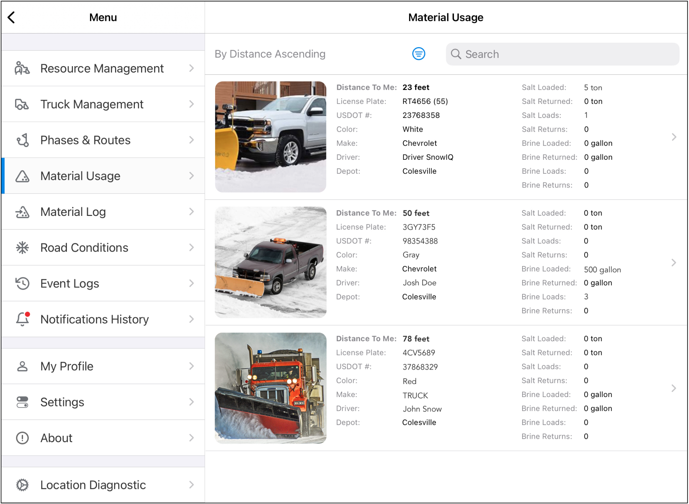
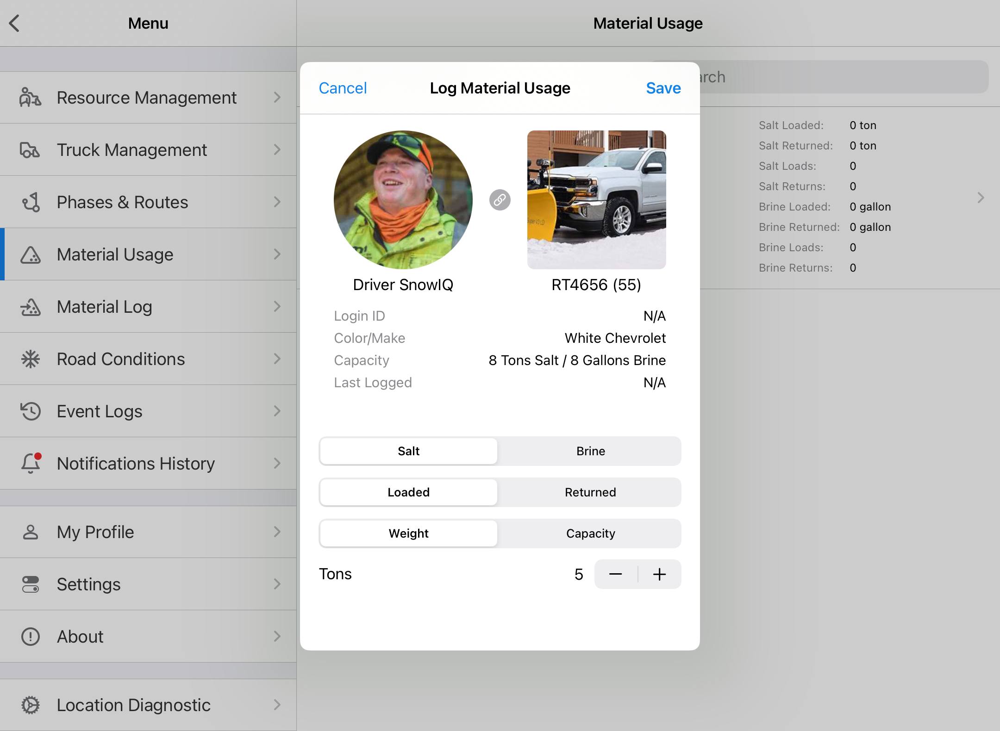
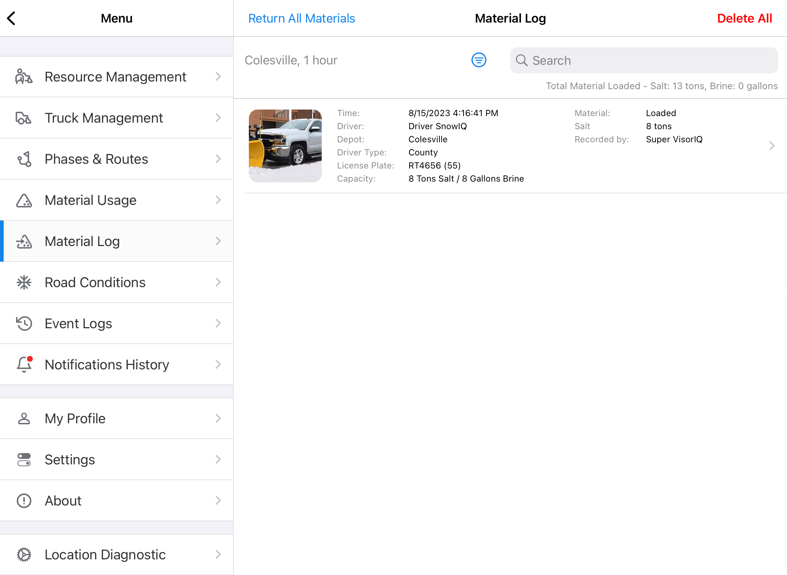

# Material Management

## Material Usage

The Material Usage screen is accessible on the main menu of the Supervisor App.

The Material Usage screen displays a list of trucks within a 100-foot radius of the user's current position.

Resources can be filtered by Supervisor/Inspector workspace, and sorted by Ascending/Descending distance.

Users can also search for a specific truck by truck details including driver, license plate, and DOT#.

## Logging Material

To log material, tap on a resource.

A detail window for the resource will be displayed, and the user can view resource details and specify material type, entry type, and amount.

## Material Log

The Material Log screen displays a list of all material loadings and returns.

The log can be filtered by material type, entry type and timeframe. Entries can also be searched by resource details.

A user can also log material from this screen by selecting an item from the list.

At the end of the event, all previously loaded materials can be returned by selecting the Return All Materials button.

