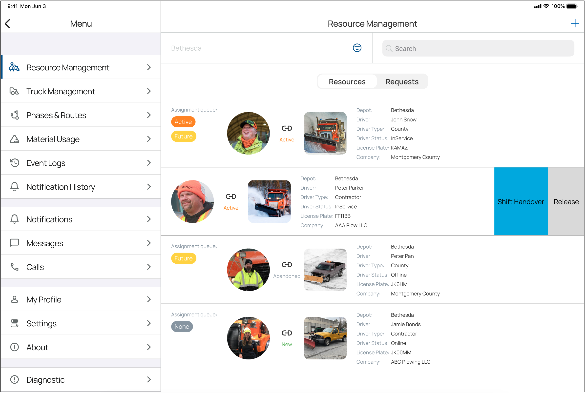
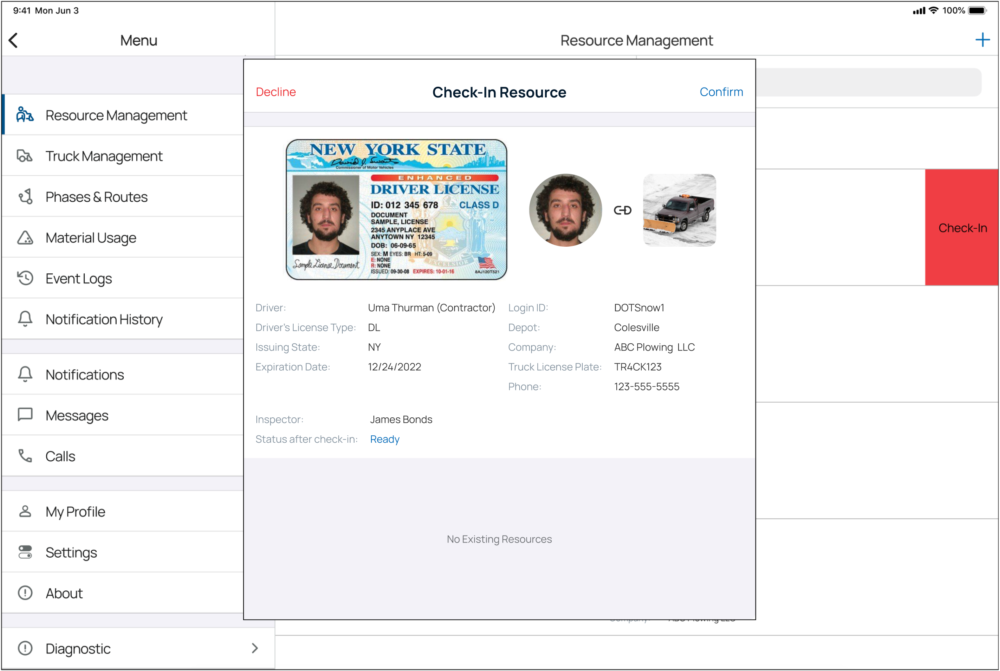

# Resource Management

The Resource Management screen is accessible using the main menu of the Supervisor App.

The Resource Management screen displays a list of existing resources for a current active event.

Resources can be filtered by Depot, State, and Type.

To manage a resource, slide its row in the list to the left, then select an option.

Select the switch at the top of the screen to access the Requests view.

The Requests view will display a list of drivers who have requested to participate in the current active event.

## Check-In Resources

To Check-in a Driver, slide its row in the list to the left, then select Check-in.

When the Check-in Request modal opens, you can review Driver details and confirm or deny a Driver.

Once a Request is successfully confirmed, the Driver is validated as a (New) resource.

## Shift Handover

When assignments need to be moved from one resource to another, a user can initiate a shift handover procedure.

Once the handover procedure is completed and assignments are moved to a new resource, the previous driver is automatically released from the assignment.

## Release Resources

When a Driver has finished his assignments, he can be released from duty.

The release of a driver will result in an automatic logout of the driver from the Driver App.

The Truck assigned to the driver that was released will then become available for assignment to another driver.
