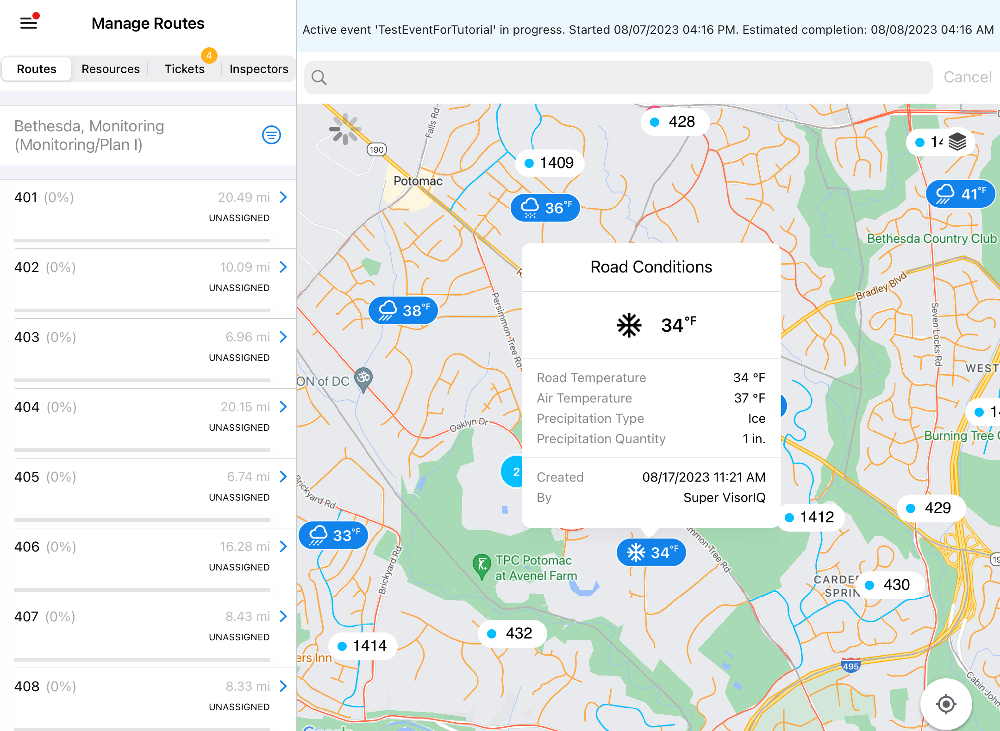
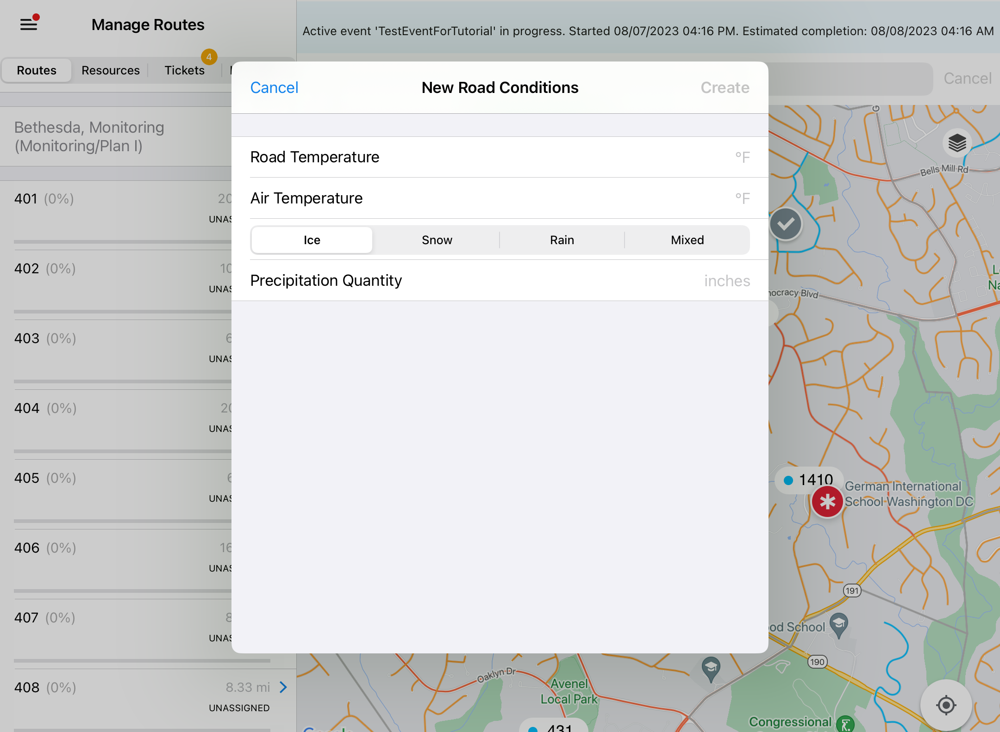
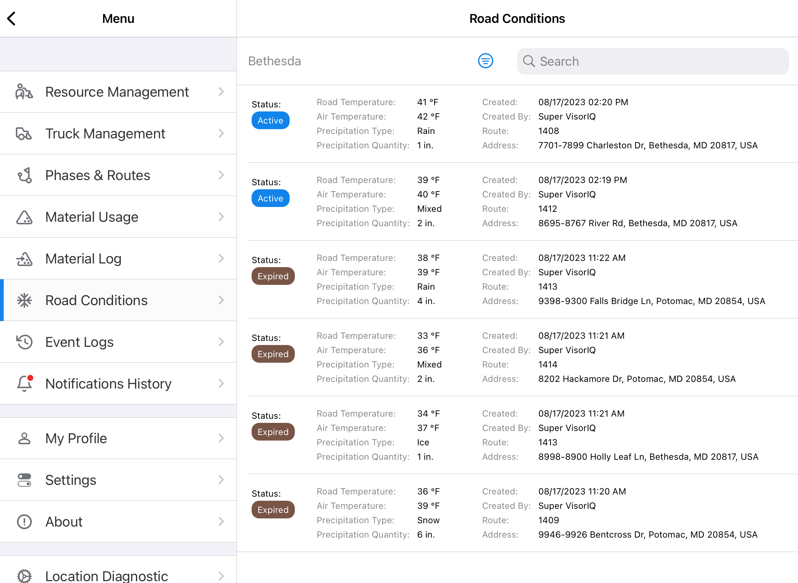

# Road Conditions

Road Conditions are temperature and precipitation details at some specific location of a service area, reported by supervisors/inspector users.

To see Road Condition details tap on the marker on the map.

## Creating Road Conditions

To create a Road Condition:

* On the map long tap on a location
* Choose 'Add New Road Condition'
* The ‘New Road Condition’ window with the form will appear

* Fill out the form with Road Condition details
* Tap 'Create'

The Road Condition marker icon will appear on the map, and it's going to be visible to all the users.

## Road Conditions menu

The Road Conditions screen is accessible through the main menu and displays a list of all reported conditions.

The list can be filtered and sorted by depot and time frame. Also, entries can be searched by reporter, route and address.

## Road Conditions expiration

All the Road Conditions automatically expire within 1 hour from reporting.

Status of a condition changed from 'Active' to 'Expired'.

Expired Road Condition disappears from the map, but it is available in the Road Conditions menu until the end of a Storm Event.