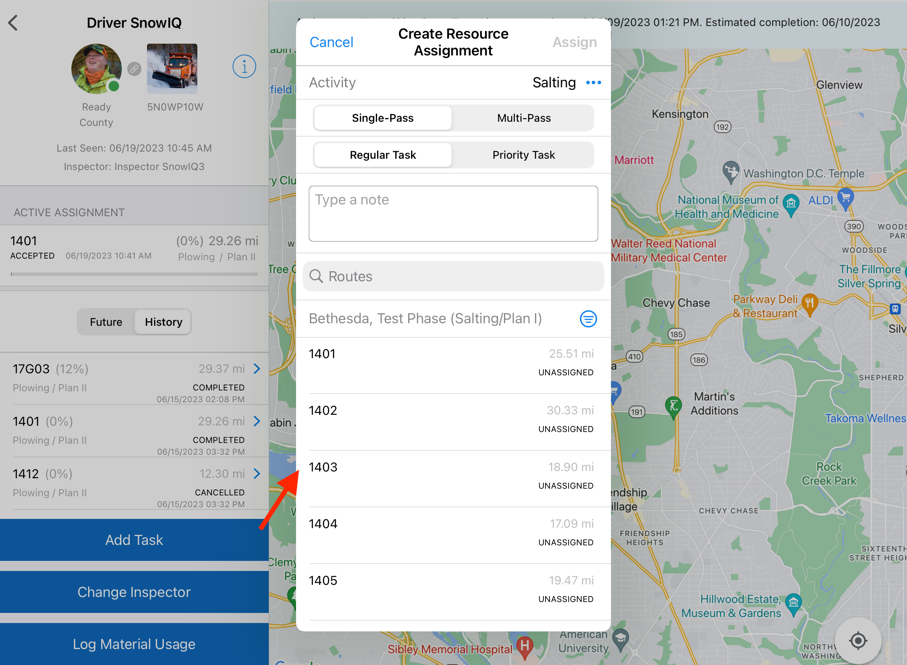
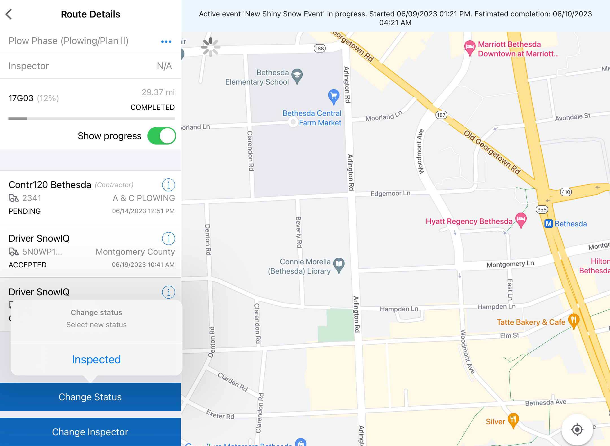
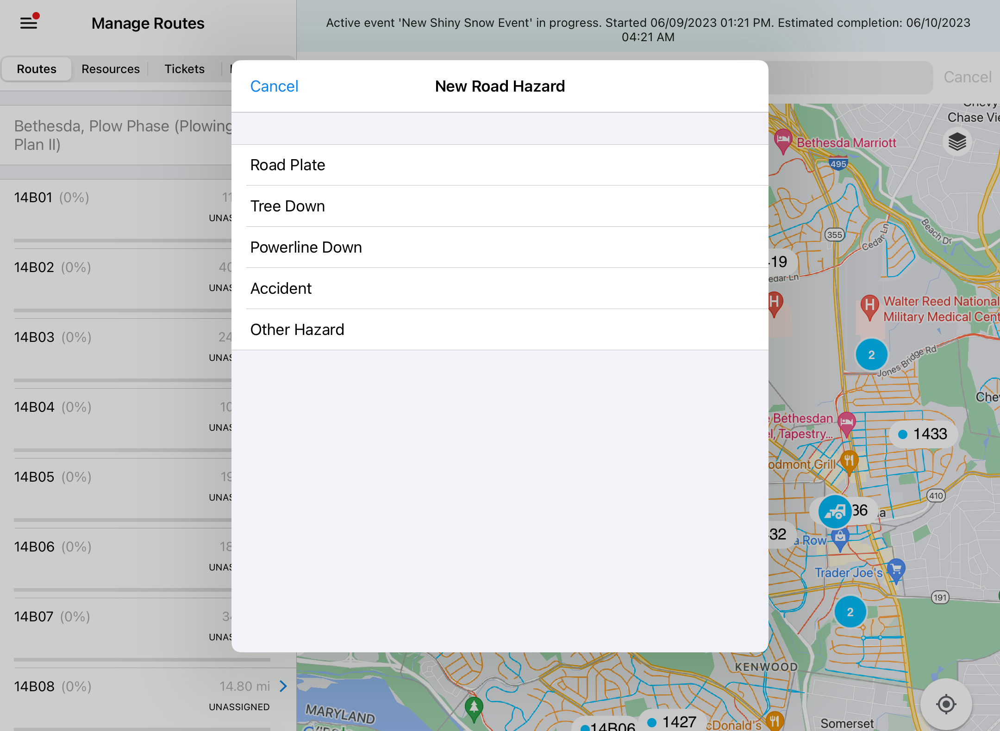
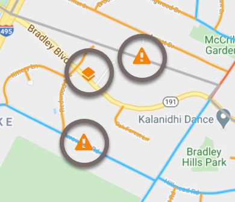

<section id="Supervisor-Activities" markdown="1">
# Supervisor Activities

<section id="Creating-New-Assignments" markdown="1">
## Creating New Assignments

There are three ways to create new assignments within the Supervisor App: 
1. From the Routes tab by selecting 'Assign new Resource' 
2. From the Resource Details panel by selecting 'Add Task'  
3. From the Map Monitoring view by selecting a Route or Resource

<section id="Assigning-New-Resources" markdown="1">

### Assigning Resource to a Route

A Supervisor can assign a new resource to a route by following the steps below:

* From the 'Routes Details' panel, tap 'Assign Resource' as shown below.

 

* In the 'Assign Resource' dialogue, do the following:
  * Select type of Activity
  * Specify whether the assignment is Single-Pass or Multi-Pass using the Multi-Pass toggle control
  * Specify whether it is a priority task using the Priority task toggle control
  * Enter a note to the Resource
  * Select a Resource by either searching for a Driver name in the search bar, or by selecting an available resource from the list which can be filtered by Depot (defaulted to the Supervisor's Depot), and/or Resource Type (County or Contractor)

* Select 'Assign'
* This will add the assignment to the Route Details with the name of the Driver, along with an Assignment status of 'Pending' to indicate that the Assignment has been sent to the Driver but not yet accepted. It also adds the Assignment to the the list of Future Assignments for the Resource, as described and shown in the section below. This action will also be sent to the Driver App to prompt the Driver to accept the Assignment.

<section id="Adding-Tasks" markdown="1">
### Adding Task to a Resource

A Supervisor can add a new task to a Resource by doing the following:

* From the Resource Details panel, tap 'Add Task'

* In the 'Create Resource Assignment' dialogue, complete the following:
  * Select type of Activity
  * Specify whether the assignment is Single-Pass or Multi-Pass using the Multi-Pass toggle control
  * Specify whether it is a priority task using the Priority task toggle control. If selected, the assignment will be placed at the top of the queue of the Future list of assignments for the Driver.
  * Enter a note to the Driver
  * Select the route by either searching for a route number or by selecting an available route from the routes available based on the selected Depot filter Depot (which defaults to the Supervisor's Depot)
* Select 'Assign'

* This will add the assignment to the Future list for the Driver with a status of 'Pending'. This indicates that the assignment has been sent to the Driver but not yet accepted. The system will prompt the Driver in the Driver App (DA) to accept the Assignment.

</section>

<section id="Creating-Address-Specific-Assignment" markdown="1">
### Creating Address Specific Assignment

A Supervisor can create an Assignment related to a specific address by doing the following:

* From the Map Monitoring view (either tab: Routes, Resources, or Tickets), tap the magnifying glass or search bar and enter the address for the assignment

* The system will display a location marker on the map
* Tap the marker and complete the address specific assignment prompt, as shown below
  * Select type of Activity
  * Specify whether it is a priority task using the Priority task toggle control. If selected, the assignment will be placed at the top of the queue of the Future list of assignments for the resource.
  * Enter a note to the Resource
  * Select a Resource by either searching for a Driver name in the search bar, or by selecting an available resource from the list which can be filtered by Depot (defaulted to the Supervisor's Depot), and/or Resource Type (County or Contractor)
* Tap 'Assign'

* This will add the assignment
</section>
</section>

<section id="Completing-Assignments-for-Multi-Passes" markdown="1">

## Completing Assignments for Multi-Passes

A multi-pass Assignment (which is an assignment was created when the multi-pass toggle was switched On) requires a Supervisor to determine the next step after each pass is completed by the Driver. Once the Driver completes a pass, the Supervisor receives a 'Pass Completion Notice' prompt with  details about the assignment, including the number of passes made, as shown below. A Supervisor then has two options:  
1. Tap 'Another Pass' to notify the Driver to continue working on the assignment, or
1. Tap 'Complete' to complete the multi-pass assignment. 

If a Supervisor selects the first option, the system notifies the Driver to continue working on the assignment (i.e. make another pass). If the supervisor selects the second option, the system marks the multi-pass Assignment as Completed and removes it from the respurce's Active Assignments. Completed assignments can be viewed by selecting the History tab.

</section>

<section id="Cancelling-Assignments" markdown="1">

## Canceling Assignments

Supervisors can cancel assignments by doing the following:

* Select the Resource from the Manage Resource menu 
* Select the Resource filter
* Select the Resource for the assignment
* Swipe the Assignment left
* When prompted to confirm the cancellation, select 'Yes'

</section>

<section id="Routes" markdown="1">
## Routes
<section id="Inspecting-Routes" markdown="1">
### Inspecting Routes

Once a Route has all its assignments completed, a Supervisor needs to change the status of that route to 'Inspected' to verify that the route is finished. To do this, navigate to the Route Details panel and select 'Change Status', and then select 'Inspected' on the prompt.
 

</section>
</section>

<section id="Resource" markdown="1">

## Resource

<section id="Changing-Resource-Status" markdown="1">

### Changing Resource Status

A Supervisor can change the status of a contractor resource.

<section id="Assigning-Resource-to-Tickets" markdown="1">

### Assigning Resource to Tickets

A Supervisor can assign an existing ticket to a Resource, by doing the following:

* Navigate to the Tickets tab
* Select the ticket to assign
* On the 'Routes Details' panel, select 'Assign Resource'.

* In the 'Assign Resource' dialogue, do the following:
   * Select type of Activity
   * Specify whether it is a priority task using the Priority task toggle control. If selected, the assignment will be placed at the top of the queue of the Future list of assignments for the Driver.
   * Enter a note to the driver
   * Select a Resource by either searching for a Driver name in the search bar, or by selecting an available resource from the list which can be filtered by Depot (defaulted to the Supervisor's Depot), and/or Resource Type (County or Contractor)
* Tap 'Assign'

This will remove the 'New' tag from the ticket on the ticket list and change the color of the ticket marker on the map to yellow  to indicate that the ticket status is 'Assigned' but not yet accepted by the Driver. It will also notify the Driver to accept the ticket assignment.

</section>

<section id="Pausing-or-Resuming-Resource" markdown="1">
### Pausing or Resuming Resource

A Supervisor may want to pause an assignment to document that no work is being performed on the route for a period of time. This may occur if a resource resource must refill salt or go to gas station. Pausing an assignment ensures that off-route travel is not included in route information. When the Resource status is 'In Service', a Supervisor can pause an Active Assignment that a Driver has accepted or is working on, or resume it after it's been paused by doing the following:

* From the Driver Details panel, select 'Pause' and then select 'Yes' on the verification prompt
* The system will change the resource's status to 'Paused', and will notify the Driver in the Driver App that their Assignment has been paused and to wait for further instructions
* To resume the assignment, select 'Resume' on the paused Resource

 </section>
 </section>
 </section>

<section id="Road-Hazards" markdown="1">
## Road Hazards

<section id="Creating-Road-Hazards" markdown="1">
### Creating Road Hazards

A Supervisor can create a road hazard on the map to warn Drivers of the hazards on their routes, by doing the following:
* From the Map Monitoring view (either tab: Routes, Resource, or Tickets), tap on the map where the road hazard is located
* The system will display the following 'New road hazard' prompt
* Select the type of road hazard and then select 'Yes' on the prompt to confirm the creation of a new road hazard

* The system will display the hazards as either a road plate or a warning, as shown below:
  * Road plates (orange stacked layes marker): A permanent hazard on the road
  * Temporary hazard (orange warning triangle marker): tree down/power line down, accident, etc.
    **Note:** These hazards will appear on the map for all Supervisors and Drivers that are working in the same service area

</section>

<section id="Deleting-Road-Hazards" markdown="1">
### Deleting Road Hazards

A Supervisor can delete an existing road hazard from the map if it doesn't exist anymore by doing the following:

  * Press on an existing road hazard from the map if it doesn't exist anymore:

  * The system will display the following 'Road hazard info' prompt
  * Press 'Delete' and press 'Yes' on the next prompt to confirm deletion of the road hazard
  * Once deleted, the marker is removed from the map for everyone

</section>
</section>
</section>
