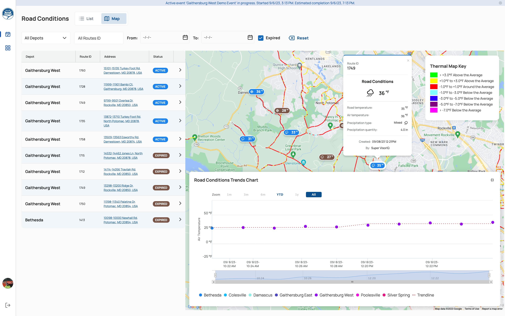

# Road Conditions

Road Condition is Road Surface Temperature and Precipitation details at some specific location of the service area.

All the Road Conditions are reported by Supervisors/Inspector users using the Supervisor App.

## Road Conditions page

The Road Conditions page is accessible through the main menu of the Web Portal and contains all reported conditions.

{: data-lightbox="1"}

The road conditions page can present items in two modes: List and List+Map. To change the mode, click on the switch in the upper left corner of the screen.

The list can be filtered and sorted by Depot, Route ID, and time frame. The user can also show/hide expired conditions by clicking the "Expired" checkbox.

## Thermal Map

The map contains an additional visualization thermal layer.

The Thermal Map displays color-coded temperature variations corresponding to the route segments of the service area. 

The map has a thermal map key which is a map legend which displays the temperature bracket for each color representing data on the map.

## Trends Chart

The map also contains the Road Conditions Trends Chart module in the right lower part of the screen.

The Road Conditions Trends Chart is a graph representing temperature changes.

The Trends Chart can be shown/hidden by clicking the plus icon in the right part of the module.

It can be also customized by sliding the time frame bracket.

## Road Conditions expiration

All of the Conditions automatically expire within 1 hour after being reported.

Upon expiration, the status of a condition is changed from 'Active' to 'Expired', and the marker color is changed from blue to brown.
